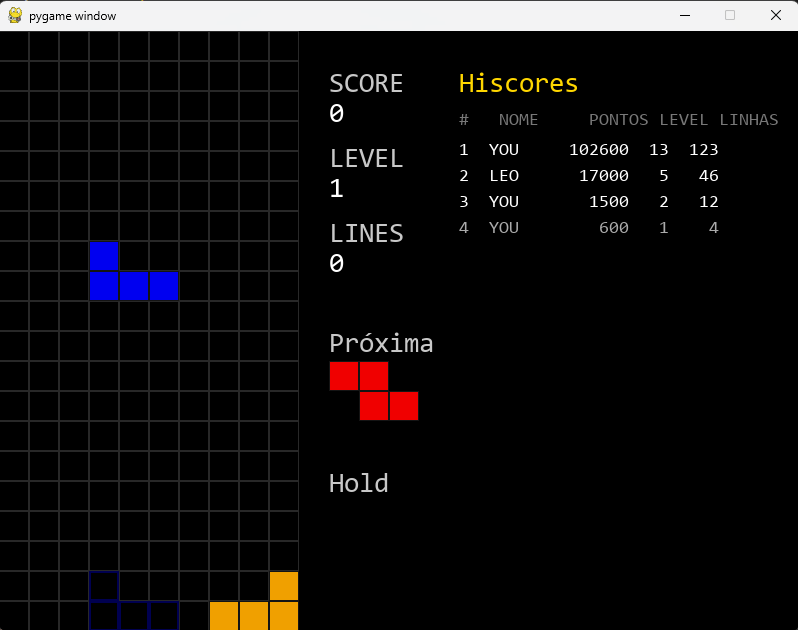

# Tetris

Um Tetris completo construído do zero em Python com `pygame`, com as mecânicas e o "game feel" do Tetris moderno: wall kick, lock delay, ghost piece, 7-bag randomizer, DAS e um placar de recordes Top 10 estilo arcade.

## Demonstração



## Funcionalidades

### Jogabilidade
- **7 tetrominós** (I, O, T, S, Z, J, L) com cores próprias.
- **Queda baseada em tempo**, desacoplada do framerate (`delta time`).
- **Sistema de níveis**: a cada 10 linhas o nível sobe e a queda acelera (piso de 100 ms). A pontuação é multiplicada pelo nível.
- **Limpeza de linhas** com pontuação progressiva (1/2/3/4 linhas = 100/300/500/800 pontos, × nível).

### Game feel (Tetris moderno)
- **Wall kick** — ao girar junto a uma parede ou bloco, a peça tenta se deslocar antes de desistir da rotação, habilitando encaixes apertados e T-spins.
- **Lock delay** — pequeno atraso antes de a peça travar ao encostar no fundo, permitindo ajuste de última hora.
- **Ghost piece** — sombra translúcida mostrando onde a peça vai cair.
- **7-bag randomizer** — as 7 peças são sorteadas em sacos embaralhados, evitando sequências ruins (padrão competitivo).
- **DAS (Delayed Auto Shift)** — segurar ← / → move a peça repetidamente, com delay inicial e taxa de repetição configuráveis.

### Interface e recursos
- Painel lateral com **SCORE**, **LEVEL** e **LINES**.
- Prévia da **próxima peça** e da peça em **hold**.
- **Hold** (guardar/trocar peça) com uso único por peça.
- **Hard drop** (despencar a peça instantaneamente).
- **Pausa** que congela o jogo mantendo a tela visível.
- **Top 10 de recordes** persistente, sempre visível na lateral, com nome do jogador, pontuação, nível e linhas.
- **Input de nome estilo arcade** ao bater um recorde (3 caracteres).
- **Game over** com reinício rápido.

## Controles

| Tecla        | Ação                          |
|--------------|-------------------------------|
| ← / →        | Mover (segure para repetir)   |
| ↓            | Descida suave                 |
| ↑            | Rotacionar                    |
| Espaço       | Hard drop                     |
| C            | Hold (guardar / trocar peça)  |
| P            | Pausar / despausar            |
| R            | Reiniciar (na tela de game over) |

Ao bater um recorde, digite 3 caracteres (letras ou números) e pressione **Enter** para registrar seu nome no Top 10.

## Como rodar

**Pré-requisitos:** Python 3.12 e `pygame`.

```bash
# Clonar o repositório
git clone https://github.com/leofregnani/Tetris.git
cd Tetris

# (Opcional) criar um ambiente virtual
python -m venv .venv
# Windows
.venv\Scripts\activate
# Linux / macOS
source .venv/bin/activate

# Instalar a dependência
pip install pygame

# Rodar
python main.py
```

## Estrutura

```
Tetris/
├── main.py           # Jogo completo
├── hiscores.json     # Recordes persistidos (criado na primeira partida)
└── README.md
```

O arquivo `hiscores.json` é gerado automaticamente na primeira vez que um recorde é registrado. Ele guarda uma lista de entradas no formato `{"name", "score", "lines", "level"}`.

## Detalhes técnicos

- **Peças como matrizes** de 0s e 1s, o que torna a rotação uma operação uniforme (`transpor + inverter`).
- **Colisão centralizada** numa única função `valid()`, reutilizada em queda, movimento, rotação e hard drop.
- **Máquina de estados** (`playing` / `enter_name` / `game_over`) separando a lógica de jogo do render e do tratamento de input.
- **Persistência em JSON** com tratamento de arquivo inexistente ou corrompido.

## Licença

Distribuído sob a licença MIT. Veja `LICENSE` para mais informações.